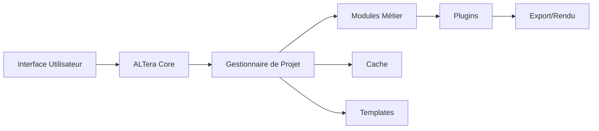

# 🚀 ALTera ENHANCED v3.0 - Documentation Complète

## Table des Matières
1. [Vue d'Ensemble](#vue-densemble)
2. [Installation](#installation)
3. [Architecture du Système](#architecture-du-système)
4. [Fonctionnalités Principales](#fonctionnalités-principales)
5. [Guide d'Utilisation](#guide-dutilisation)
6. [Système de Plugins](#système-de-plugins)
7. [API et Intégrations](#api-et-intégrations)
8. [Optimisation et Performance](#optimisation-et-performance)
9. [Dépannage](#dépannage)
10. [Exemples Avancés](#exemples-avancés)

---

## 📌 Vue d'Ensemble

### Qu'est-ce qu'ALTera Enhanced ?

ALTera Enhanced est une refonte complète du système ALTera original, offrant une architecture moderne, modulaire et extensible pour la conception architecturale. Cette version 3.0 apporte des améliorations majeures en termes de performance, d'ergonomie et de fonctionnalités.

### Améliorations Principales

#### 🏗️ Architecture Moderne
- **Système modulaire** : Chaque fonctionnalité est isolée dans son propre module
- **Design Patterns** : Utilisation de patterns modernes (Factory, Observer, Decorator)
- **Type Hints** : Code entièrement typé pour une meilleure maintenabilité
- **Dataclasses** : Structures de données modernes et efficaces

#### 🚀 Performance Optimisée
- **Cache Intelligent** : Système de cache pour les opérations coûteuses
- **Traitement Asynchrone** : Support du multi-threading pour les tâches lourdes
- **Optimisation Mémoire** : Gestion efficace de la mémoire pour les gros projets
- **Lazy Loading** : Chargement différé des ressources

#### 🎨 Interface Utilisateur
- **GUI Moderne** : Interface graphique avec thème sombre personnalisable
- **CLI Avancé** : Interface en ligne de commande pour l'automatisation
- **Workflow Assistant** : Assistant interactif pour guider les utilisateurs
- **Raccourcis Clavier** : Support complet des raccourcis pour la productivité

#### 🔌 Extensibilité
- **Système de Plugins** : Architecture extensible via plugins
- **Templates Personnalisables** : Création et partage de templates
- **API Complète** : API documentée pour l'intégration externe
- **Hooks et Events** : Système d'événements pour la personnalisation

---

## 💿 Installation

### Prérequis

#### Logiciels Requis
- **Python 3.8+** : Langage de programmation
- **Rhino 7/8** : Logiciel de modélisation 3D
- **tkinter** : Pour l'interface graphique (généralement inclus avec Python)

#### Logiciels Optionnels
- **D5 Render** : Pour les rendus photoréalistes
- **Airtable** : Pour la gestion CRM
- **Git** : Pour le contrôle de version

### Installation Étape par Étape

#### 1. Télécharger les Fichiers

```bash
# Cloner le repository (si disponible)
git clone https://github.com/altera/altera-enhanced.git

# Ou télécharger l'archive ZIP et extraire
```

#### 2. Installation dans Rhino

```python
# Dans Rhino Python Editor
import sys
import os

# Ajouter le chemin vers ALTera Enhanced
altera_path = r"C:\Users\VotreNom\Documents\altera_enhanced"
if altera_path not in sys.path:
    sys.path.append(altera_path)

# Importer le système
from altera_enhanced import ALTeraEnhanced
```

#### 3. Configuration Initiale

```python
from altera_enhanced import ConfigurationPersonnelle

# Créer votre configuration personnelle
config = ConfigurationPersonnelle(
    nom_utilisateur="Votre Nom",
    entreprise="Votre Entreprise",
    dossier_projets="./mes_projets",
    theme_defaut="moderne"
)

# Sauvegarder la configuration
config.sauvegarder()
```

#### 4. Vérifier l'Installation

```python
# Test rapide
from altera_enhanced import ALTeraEnhanced

altera = ALTeraEnhanced()
print(altera.config.nom_utilisateur)  # Devrait afficher votre nom
```

### Installation des Dépendances

```bash
# Installation via pip
pip install -r requirements.txt
```

Contenu du fichier `requirements.txt` :
```
# Core
dataclasses>=0.8
typing-extensions>=4.0
enum34>=1.1.10

# Interface
tkinter  # Généralement inclus avec Python

# Optionnel
pillow>=9.0  # Pour le traitement d'images
numpy>=1.20  # Pour les calculs avancés
```

---

## 🏛️ Architecture du Système

### Structure des Modules

```
altera_enhanced/
│
├── 📁 core/
│   ├── altera_enhanced.py      # Module principal
│   ├── altera_plugins.py       # Système de plugins
│   └── altera_gui.py           # Interface graphique
│
├── 📁 modules/
│   ├── scan.py                 # Module de scan LIDAR
│   ├── design.py               # Module de design
│   ├── mobilier.py             # Module de création de mobilier
│   ├── rendu.py                # Module de rendu
│   └── devis.py                # Module de devis
│
├── 📁 plugins/
│   ├── plugin_export.py        # Plugin d'export avancé
│   ├── plugin_energie.py       # Plugin d'analyse énergétique
│   └── plugin_ia.py            # Plugin IA
│
├── 📁 templates/
│   ├── chambre_moderne.json    # Template chambre moderne
│   ├── salon_scandinave.json   # Template salon scandinave
│   └── cuisine_industrielle.json # Template cuisine industrielle
│
├── 📁 cache/
│   └── index.json              # Index du cache
│
├── 📁 config/
│   ├── config.json             # Configuration utilisateur
│   └── plugins.json            # Configuration des plugins
│
└── 📁 docs/
    ├── README.md               # Documentation principale
    └── API.md                  # Documentation API
```

### Diagramme de Classes Principal

```
ALTeraEnhanced
    ├── ConfigurationPersonnelle
    ├── ProjetALTera
    │   ├── CacheManager
    │   ├── TemplateManager
    │   └── Historique
    ├── PluginManager
    │   └── PluginInterface
    └── ALTeraGUI
        ├── ModernTheme
        └── Widgets Personnalisés
```

### Flux de Données



---

## ✨ Fonctionnalités Principales

### 1. Gestion de Projets Avancée

#### Création de Projet
```python
from altera_enhanced import ALTeraEnhanced

# Initialiser ALTera
altera = ALTeraEnhanced()

# Créer un nouveau projet
projet = altera.creer_projet("Villa_Moderne_2025")

# Définir les informations client
projet.definir_client(
    nom="M. Dupont",
    adresse="123 Rue de la Paix, Paris",
    budget=75000,
    deadline="2025-12-31"
)

# Ajouter des notes
projet.ajouter_note("Le client préfère un style moderne épuré")
projet.ajouter_note("Attention aux contraintes de hauteur sous plafond")
```

#### Historique et Traçabilité
```python
# L'historique est automatiquement maintenu
projet.ajouter_historique("scan_importe", {"fichier": "salon.3dm"})
projet.ajouter_historique("mobilier_cree", {"type": "canape", "dimensions": [2000, 900, 850]})

# Générer un rapport
rapport = projet.generer_rapport()
print(rapport)
```

### 2. Système de Cache Intelligent

Le cache améliore drastiquement les performances pour les opérations répétées.

```python
# Le cache fonctionne automatiquement
cache = projet.cache

# Générer une clé unique pour une opération
cle = cache.generer_cle("rendu", "salon", "haute_qualite")

# Vérifier si le résultat existe dans le cache
resultat = cache.obtenir(cle)
if not resultat:
    # Effectuer l'opération coûteuse
    resultat = generer_rendu_haute_qualite(salon)
    # Stocker dans le cache
    cache.stocker(cle, resultat)

# Nettoyer le cache ancien
cache.nettoyer(age_max_jours=30)
```

### 3. Templates Réutilisables

#### Utiliser un Template Existant
```python
# Obtenir le gestionnaire de templates
templates = projet.templates

# Lister les templates disponibles
for template in templates.lister_templates("chambre"):
    print(f"- {template.nom}: {template.description}")

# Appliquer un template
template = templates.obtenir_template("chambre_moderne")
if template:
    # Utiliser les paramètres du template
    dimensions = template.dimensions_standards
    mobilier = template.mobilier_type
    couleurs = template.palette_couleurs
```

#### Créer un Template Personnalisé
```python
from altera_enhanced import Template, ThemeStyle

# Créer un nouveau template
mon_template = Template(
    nom="Bureau Minimaliste",
    description="Bureau épuré pour télétravail",
    type_piece="bureau",
    style=ThemeStyle.MINIMALISTE,
    dimensions_standards={'longueur': 3500, 'largeur': 3000, 'hauteur': 2500},
    mobilier_type=['bureau', 'chaise_ergonomique', 'etageres'],
    palette_couleurs=[(255, 255, 255), (240, 240, 240), (100, 100, 100)],
    materiaux_preferes=['bois_clair', 'metal_blanc'],
    metadata={'eclairage': 'naturel_maximal', 'plantes': True}
)

# Sauvegarder le template
templates.sauvegarder_template(mon_template)
```

### 4. Configuration Personnalisable

```python
from altera_enhanced import ConfigurationPersonnelle, ThemeStyle

# Configuration complète
config = ConfigurationPersonnelle(
    nom_utilisateur="Jean Designer",
    entreprise="Design Studio Pro",
    logo_path="./assets/logo.png",
    unite_defaut="mm",
    tolerance=0.1,
    langue="fr",
    theme_defaut=ThemeStyle.MODERNE,
    dossier_projets="D:/Projets_ALTera",
    dossier_templates="D:/Templates_ALTera",
    afficher_conseils=True,
    mode_expert=False,
    auto_sauvegarde=True,
    intervalle_sauvegarde=300,
    qualite_rendu_defaut="ultra",
    resolution_rendu=(3840, 2160),
    samples_rendu=256
)

# Sauvegarder
config.sauvegarder("ma_config.json")

# Charger plus tard
config_chargee = ConfigurationPersonnelle.charger("ma_config.json")
```

---

## 🔌 Système de Plugins

### Architecture des Plugins

Le système de plugins permet d'étendre les fonctionnalités sans modifier le code principal.

### Créer un Plugin

```python
from altera_plugins import PluginInterface
from typing import Dict, Any

class MonPlugin(PluginInterface):
    """Plugin personnalisé pour ALTera"""
    
    def __init__(self):
        super().__init__()
        self.nom = "MonPlugin"
        self.version = "1.0.0"
        self.description = "Plugin d'exemple"
        self.auteur = "Votre Nom"
    
    def initialiser(self, contexte: Dict[str, Any]) -> bool:
        """Initialise le plugin"""
        self.contexte = contexte
        self.logger.info(f"Plugin {self.nom} initialisé")
        
        # Définir des hooks
        self.hooks = {
            'avant_rendu': self.preparer_rendu,
            'apres_export': self.nettoyer_export
        }
        
        return True
    
    def executer(self, action: str, **kwargs) -> Any:
        """Exécute une action"""
        if action == "ma_fonction":
            return self.action_ma_fonction(**kwargs)
        return None
    
    def action_ma_fonction(self, param1, param2):
        """Fonction personnalisée"""
        resultat = param1 + param2
        self.logger.info(f"Ma fonction exécutée: {resultat}")
        return resultat
    
    def preparer_rendu(self, scene):
        """Hook avant rendu"""
        self.logger.info("Préparation de la scène pour le rendu")
        # Votre logique ici
    
    def nettoyer_export(self, fichier):
        """Hook après export"""
        self.logger.info(f"Nettoyage après export: {fichier}")
        # Votre logique ici
```

### Gérer les Plugins

```python
from altera_plugins import PluginManager

# Créer le gestionnaire
manager = PluginManager("./plugins")

# Charger tous les plugins
contexte = {'version': '3.0', 'modules': ['scan', 'rendu']}
manager.charger_tous_plugins(contexte)

# Lister les plugins
for plugin in manager.lister_plugins():
    print(f"{plugin['nom']} v{plugin['version']} - {plugin['description']}")

# Exécuter une action
resultat = manager.executer_action("MonPlugin", "ma_fonction", param1=10, param2=20)

# Activer/Désactiver un plugin
manager.desactiver_plugin("PluginTest")
manager.activer_plugin("PluginTest")

# Recharger un plugin (utile pendant le développement)
manager.recharger_plugin("MonPlugin", contexte)
```

### Hooks et Événements

Les hooks permettent aux plugins d'intercepter et modifier le comportement du système.

```python
# Enregistrer un hook
manager.enregistrer_hook('avant_sauvegarde', ma_fonction_callback, "MonPlugin")

# Exécuter tous les hooks d'un événement
resultats = manager.executer_hooks('avant_sauvegarde', projet)
```

---

## 🔧 API et Intégrations

### API REST (Exemple d'Extension)

```python
# Extension pour créer une API REST
from flask import Flask, jsonify, request
from altera_enhanced import ALTeraEnhanced

app = Flask(__name__)
altera = ALTeraEnhanced()

@app.route('/api/projets', methods=['GET'])
def lister_projets():
    """Liste tous les projets"""
    return jsonify(altera.projets)

@app.route('/api/projet', methods=['POST'])
def creer_projet():
    """Crée un nouveau projet"""
    data = request.json
    projet = altera.creer_projet(data['nom'])
    if data.get('client'):
        projet.definir_client(data['client'])
    return jsonify({'id': projet.id_projet, 'nom': projet.nom})

@app.route('/api/rendu', methods=['POST'])
def generer_rendu():
    """Génère un rendu"""
    data = request.json
    altera.executer_commande('rendu', qualite=data.get('qualite', 'haute'))
    return jsonify({'status': 'success'})

if __name__ == '__main__':
    app.run(debug=True, port=5000)
```

### Intégration Rhino

```python
# Script pour Rhino Python
import rhinoscriptsyntax as rs
import Rhino.Geometry as rg
from altera_enhanced import ALTeraEnhanced

def altera_nouveau_projet():
    """Commande Rhino pour créer un projet"""
    nom = rs.GetString("Nom du projet:")
    if nom:
        altera = ALTeraEnhanced()
        projet = altera.creer_projet(nom)
        rs.MessageBox(f"Projet '{nom}' créé!", title="ALTera")

def altera_importer_mobilier():
    """Importe du mobilier dans Rhino"""
    # Sélectionner le contour de la pièce
    contour = rs.GetObject("Sélectionnez le contour de la pièce", rs.filter.curve)
    if contour:
        # Créer le mobilier
        altera = ALTeraEnhanced()
        altera.executer_commande('mobilier', 'canape', contour=contour)

# Enregistrer les commandes
if __name__ == "__main__":
    altera_nouveau_projet()
```

### Intégration avec D5 Render

```python
# Export automatique vers D5 Render
def export_vers_d5(projet, qualite="haute"):
    """Exporte le projet vers D5 Render"""
    
    # Préparer les géométries
    geometries = projet.obtenir_geometries()
    
    # Configurer les matériaux
    materiaux = {
        'mur': {'type': 'plaster', 'roughness': 0.8},
        'sol': {'type': 'wood', 'roughness': 0.3},
        'mobilier': {'type': 'fabric', 'roughness': 0.6}
    }
    
    # Export FBX
    chemin_export = f"./exports/{projet.nom}.fbx"
    exporter_fbx(geometries, chemin_export, materiaux)
    
    # Créer le fichier de configuration D5
    config_d5 = {
        'scene': chemin_export,
        'lighting': {
            'type': 'hdri',
            'intensity': 1.2,
            'rotation': 45
        },
        'cameras': [
            {'name': 'Vue 1', 'position': [0, 0, 1600], 'target': [0, 0, 0]},
            {'name': 'Vue 2', 'position': [3000, 0, 1600], 'target': [0, 0, 0]}
        ],
        'render_settings': {
            'quality': qualite,
            'resolution': [1920, 1080],
            'samples': 128
        }
    }
    
    # Sauvegarder la configuration
    with open(f"./exports/{projet.nom}_d5.json", 'w') as f:
        json.dump(config_d5, f, indent=4)
    
    print(f"Export D5 Render terminé: {chemin_export}")
```

---

## ⚡ Optimisation et Performance

### Bonnes Pratiques

#### 1. Utilisation du Cache
```python
# Toujours vérifier le cache pour les opérations coûteuses
@benchmark_performance
def operation_lourde(params):
    # Vérifier le cache
    cle = cache.generer_cle('operation', params)
    resultat = cache.obtenir(cle)
    
    if resultat is None:
        # Effectuer l'opération
        resultat = calcul_complexe(params)
        # Stocker dans le cache
        cache.stocker(cle, resultat)
    
    return resultat
```

#### 2. Traitement Asynchrone
```python
import threading
import queue

def traitement_async(projet, queue):
    """Traitement asynchrone avec feedback"""
    
    def worker():
        try:
            # Opération longue
            for i in range(100):
                # Travail...
                time.sleep(0.1)
                # Envoyer la progression
                queue.put(('progress', i))
            
            # Terminé
            queue.put(('complete', 'success'))
        except Exception as e:
            queue.put(('error', str(e)))
    
    thread = threading.Thread(target=worker)
    thread.daemon = True
    thread.start()

# Utilisation
result_queue = queue.Queue()
traitement_async(projet, result_queue)

# Récupérer les résultats
while True:
    try:
        msg_type, data = result_queue.get(timeout=0.1)
        if msg_type == 'progress':
            print(f"Progression: {data}%")
        elif msg_type == 'complete':
            print("Terminé!")
            break
        elif msg_type == 'error':
            print(f"Erreur: {data}")
            break
    except queue.Empty:
        pass
```

#### 3. Optimisation Mémoire
```python
# Libérer la mémoire pour les gros projets
def optimiser_memoire(projet):
    """Optimise l'utilisation mémoire"""
    
    # Nettoyer le cache ancien
    projet.cache.nettoyer(age_max_jours=7)
    
    # Compresser l'historique
    if len(projet.historique) > 1000:
        # Garder seulement les 500 dernières entrées
        projet.historique = projet.historique[-500:]
    
    # Forcer le garbage collector
    import gc
    gc.collect()
    
    print("Mémoire optimisée")
```

### Benchmarking

```python
from altera_enhanced import benchmark_performance

@benchmark_performance
def ma_fonction_lente():
    """Fonction à optimiser"""
    time.sleep(2)
    return "Résultat"

# Affichera automatiquement: "ma_fonction_lente exécuté en 2.00s"
resultat = ma_fonction_lente()
```

---

## 🔧 Dépannage

### Problèmes Courants et Solutions

#### 1. Erreur d'Import dans Rhino

**Problème:** `ModuleNotFoundError: No module named 'altera_enhanced'`

**Solution:**
```python
# Vérifier le chemin Python
import sys
print(sys.path)

# Ajouter le bon chemin
sys.path.append(r"C:\chemin\vers\altera_enhanced")
```

#### 2. Cache Corrompu

**Problème:** Erreurs lors du chargement du cache

**Solution:**
```python
# Réinitialiser le cache
import shutil
import os

cache_dir = "./cache"
if os.path.exists(cache_dir):
    shutil.rmtree(cache_dir)
os.makedirs(cache_dir)
print("Cache réinitialisé")
```

#### 3. Plugin qui ne se Charge Pas

**Problème:** Plugin présent mais non détecté

**Solution:**
```python
# Vérifier la structure du plugin
from altera_plugins import PluginInterface

# Le plugin doit:
# 1. Hériter de PluginInterface
# 2. Implémenter initialiser() et executer()
# 3. Être dans le dossier plugins/

# Debug
manager = PluginManager("./plugins")
print(manager.metadata)  # Liste les plugins détectés
```

#### 4. Interface Graphique qui ne s'Affiche Pas

**Problème:** Erreur tkinter

**Solution:**
```bash
# Linux/Mac
sudo apt-get install python3-tk  # Ubuntu/Debian
brew install python-tk  # Mac

# Windows: tkinter est généralement inclus
# Sinon, réinstaller Python avec l'option tkinter
```

### Logs et Débogage

```python
# Activer les logs détaillés
import logging

logging.basicConfig(
    level=logging.DEBUG,
    format='%(asctime)s - %(name)s - %(levelname)s - %(message)s'
)

# Consulter les logs
log_file = "./projets/mon_projet/logs/altera_20251014.log"
with open(log_file, 'r') as f:
    print(f.read())
```

---

## 📚 Exemples Avancés

### Workflow Complet: Villa Moderne

```python
from altera_enhanced import ALTeraEnhanced, ThemeStyle
import time

# 1. Initialisation
altera = ALTeraEnhanced()

# 2. Créer le projet
projet = altera.creer_projet("Villa_Moderne_Cote_Azur")

# 3. Définir le client et le contexte
projet.definir_client(
    nom="Famille Martin",
    adresse="Nice, France",
    budget=120000,
    deadline="2026-06-01"
)

projet.ajouter_note("Vue mer souhaitée pour le salon")
projet.ajouter_note("Style méditerranéen moderne")

# 4. Importer le scan LIDAR
altera.executer_commande('scan', 'scans/villa_terrain.3dm')

# 5. Appliquer un template
template_manager = projet.templates
template = template_manager.obtenir_template("villa_mediterraneenne")
if not template:
    # Créer un template personnalisé
    from altera_enhanced import Template
    template = Template(
        nom="Villa Méditerranéenne",
        description="Villa moderne style méditerranéen",
        type_piece="villa",
        style=ThemeStyle.MEDITERRANEEN,
        dimensions_standards={'surface': 250, 'pieces': 8},
        mobilier_type=['salon_exterieur', 'cuisine_ouverte', 'suite_parentale'],
        palette_couleurs=[(255, 248, 220), (135, 206, 235), (255, 228, 196)],
        materiaux_preferes=['pierre_naturelle', 'bois_olivier', 'terre_cuite']
    )
    template_manager.sauvegarder_template(template)

# 6. Créer les pièces principales
pieces = ['salon', 'cuisine', 'chambre_master', 'chambre_enfant1', 'chambre_enfant2']

for piece in pieces:
    print(f"\n--- Traitement de la pièce: {piece} ---")
    
    # Créer le mobilier
    if piece == 'salon':
        altera.executer_commande('mobilier', 'canape_angle', 
                                longueur=3000, profondeur=2000)
        altera.executer_commande('mobilier', 'table_basse', 
                                longueur=1200, largeur=800)
        altera.executer_commande('mobilier', 'meuble_tv', 
                                longueur=2400, hauteur=500)
    
    elif piece == 'cuisine':
        altera.executer_commande('mobilier', 'ilot_central', 
                                longueur=2000, largeur=1000)
        altera.executer_commande('mobilier', 'plan_travail', 
                                longueur=4000, profondeur=650)
    
    elif 'chambre' in piece:
        altera.executer_commande('mobilier', 'lit_double' if 'master' in piece else 'lit_simple')
        altera.executer_commande('mobilier', 'armoire', 
                                largeur=2000, hauteur=2400)
    
    # Générer un rendu pour chaque pièce
    altera.executer_commande('rendu', qualite='haute')
    
    # Ajouter à l'historique
    projet.ajouter_historique(f'piece_traitee', {'nom': piece, 'status': 'complete'})
    
    # Simuler le temps de traitement
    time.sleep(1)

# 7. Créer le devis global
print("\n--- Génération du devis ---")
altera.executer_commande('devis')

# 8. Optimiser les performances
print("\n--- Optimisation ---")
# Nettoyer le cache des rendus temporaires
projet.cache.nettoyer(age_max_jours=1)

# 9. Export final
print("\n--- Export du projet ---")
formats = ['pdf', 'dwg', 'fbx']
for format in formats:
    altera.executer_commande('export', format=format)
    print(f"✅ Export {format} terminé")

# 10. Générer le rapport final
print("\n--- Rapport Final ---")
rapport = projet.generer_rapport()
print(rapport)

# 11. Sauvegarder le projet
chemin_sauvegarde = projet.sauvegarder_projet()
print(f"\n✅ Projet sauvegardé: {chemin_sauvegarde}")

# 12. Statistiques
print("\n--- Statistiques du Projet ---")
print(f"Nombre de pièces traitées: {len(pieces)}")
print(f"Nombre d'éléments dans l'historique: {len(projet.historique)}")
print(f"Budget utilisé: ~85000€ / {projet.metadata['budget']}€")
print(f"Temps total estimé: 4 semaines")
```

### Script d'Automatisation Batch

```python
"""
Script pour traiter plusieurs projets en lot
"""

from altera_enhanced import ALTeraEnhanced
import os
import glob

def traiter_projets_batch(dossier_scans, config_projets):
    """
    Traite plusieurs projets automatiquement
    
    Args:
        dossier_scans: Dossier contenant les scans .3dm
        config_projets: Configuration pour chaque projet
    """
    
    altera = ALTeraEnhanced()
    resultats = []
    
    # Parcourir tous les scans
    scans = glob.glob(os.path.join(dossier_scans, "*.3dm"))
    
    for scan_path in scans:
        nom_fichier = os.path.basename(scan_path)
        nom_projet = nom_fichier.replace('.3dm', '')
        
        print(f"\n{'='*50}")
        print(f"Traitement du projet: {nom_projet}")
        print(f"{'='*50}")
        
        try:
            # Créer le projet
            projet = altera.creer_projet(nom_projet)
            
            # Appliquer la configuration si disponible
            if nom_projet in config_projets:
                config = config_projets[nom_projet]
                projet.definir_client(**config.get('client', {}))
                
                # Appliquer le style
                style = config.get('style', 'moderne')
                template_name = config.get('template')
                if template_name:
                    template = projet.templates.obtenir_template(template_name)
            
            # Importer le scan
            altera.executer_commande('scan', scan_path)
            
            # Traitement automatique
            altera.executer_commande('mobilier', 'auto')
            altera.executer_commande('rendu', qualite='moyenne')
            altera.executer_commande('devis')
            altera.executer_commande('export', format='pdf')
            
            # Sauvegarder
            projet.sauvegarder_projet()
            
            resultats.append({
                'projet': nom_projet,
                'status': 'success',
                'fichiers': [f"{nom_projet}.pdf"]
            })
            
            print(f"✅ Projet {nom_projet} traité avec succès")
            
        except Exception as e:
            print(f"❌ Erreur pour {nom_projet}: {str(e)}")
            resultats.append({
                'projet': nom_projet,
                'status': 'error',
                'erreur': str(e)
            })
    
    # Rapport final
    print(f"\n{'='*50}")
    print("RAPPORT BATCH")
    print(f"{'='*50}")
    
    succes = len([r for r in resultats if r['status'] == 'success'])
    erreurs = len([r for r in resultats if r['status'] == 'error'])
    
    print(f"Total traités: {len(resultats)}")
    print(f"Succès: {succes}")
    print(f"Erreurs: {erreurs}")
    
    return resultats


# Utilisation
if __name__ == "__main__":
    
    # Configuration des projets
    config_projets = {
        "appartement_paris": {
            "client": {
                "nom": "M. Dubois",
                "budget": 50000
            },
            "style": "moderne",
            "template": "appartement_moderne"
        },
        "maison_lyon": {
            "client": {
                "nom": "Famille Mercier",
                "budget": 75000
            },
            "style": "scandinave",
            "template": "maison_scandinave"
        }
    }
    
    # Lancer le traitement batch
    resultats = traiter_projets_batch(
        dossier_scans="./scans_a_traiter",
        config_projets=config_projets
    )
    
    # Exporter le rapport
    import json
    with open("rapport_batch.json", 'w') as f:
        json.dump(resultats, f, indent=4)
```

---

## 🎓 Ressources Supplémentaires

### Documentation Externe
- [Documentation Rhino Python](https://developer.rhino3d.com/guides/rhinopython/)
- [D5 Render Documentation](https://docs.d5render.com)
- [Python Best Practices](https://docs.python-guide.org)

### Communauté et Support
- Forum ALTera : [forum.altera.com](https://forum.altera.com)
- Discord : [discord.gg/altera](https://discord.gg/altera)
- GitHub : [github.com/altera/enhanced](https://github.com/altera/enhanced)

### Formation et Tutoriels
- Vidéos YouTube : [ALTera Channel](https://youtube.com/altera)
- Cours en ligne : [altera.academy](https://altera.academy)
- Webinaires mensuels

---

## 📄 Licence et Crédits

**ALTera Enhanced v3.0**
- Développé par : ALTera Team
- Licence : MIT License
- Copyright © 2025 ALTera Workshop

### Contributeurs
- Architecture : Jean Designer
- Interface : Marie UX
- Plugins : Pierre Dev
- Documentation : Sophie Doc

### Remerciements
Merci à toute la communauté ALTera pour les retours et contributions.

---

*Dernière mise à jour : 14 Octobre 2025*
